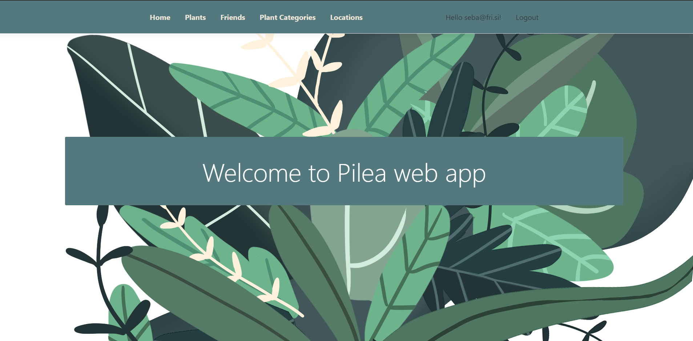
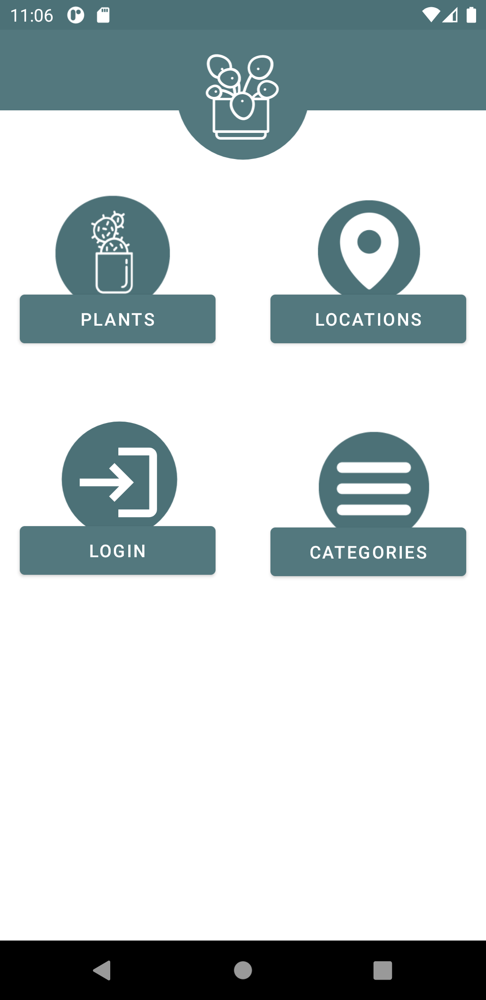
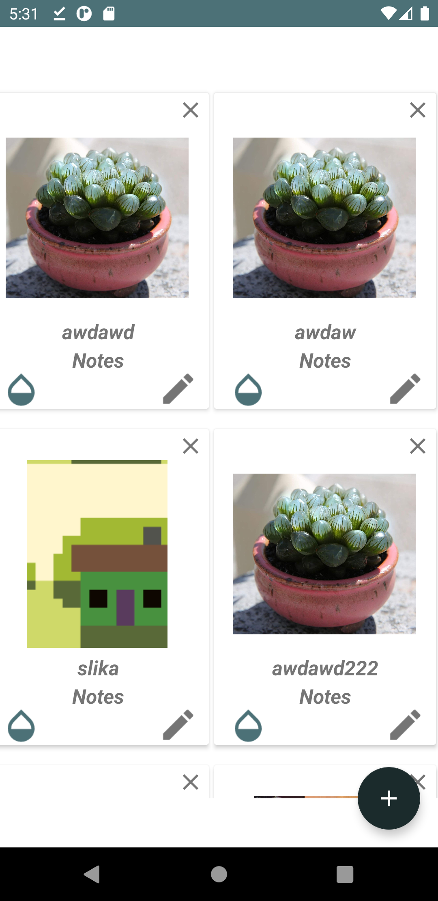
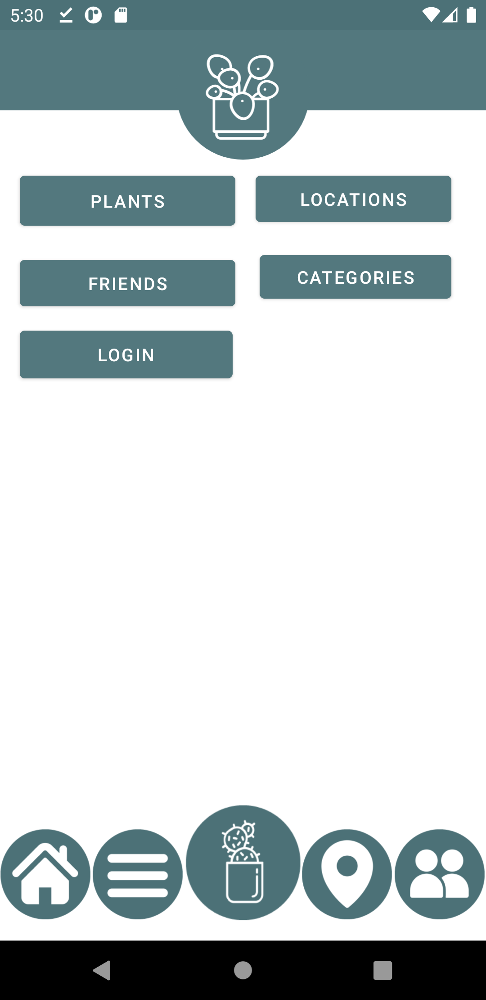
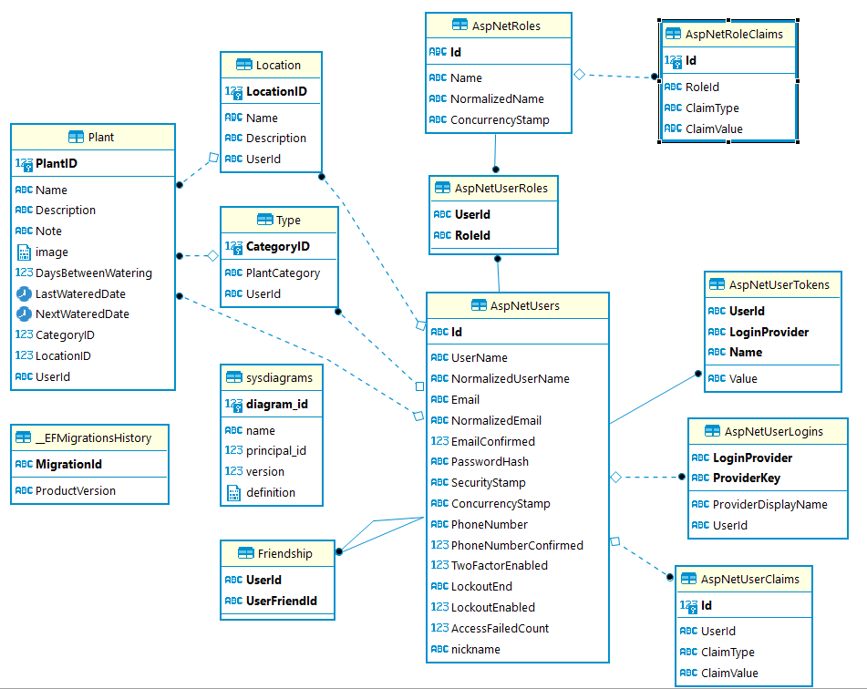

# Pilea-web

Project name: Pilea

Authors: Sebastjan Mevlja(63180203) and Beti Piščanec(63180230).

Url: https://pilea-web-dev.azurewebsites.net/

## Screenshots

  
   
  

## Summary

We've decided to create Pilea, a web application that will help us care for our plants. Pilea lets you catalog your plants and their watering cycles, as well as their pictures, descriptions and notes. All in an effort to ease plant care. Users can access their profiles from different devices without having to worry about data loss since their profiles sync automatically with the database.

## Distribution of tasks
Sebastjan has mostly worked on backend and API implementation while Beti has worked on frontend.

## Database scheme
  
Besides user data we also store plants, locations, categories and friendships.
